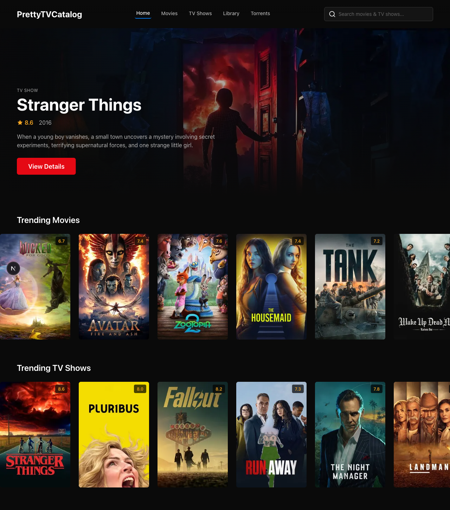
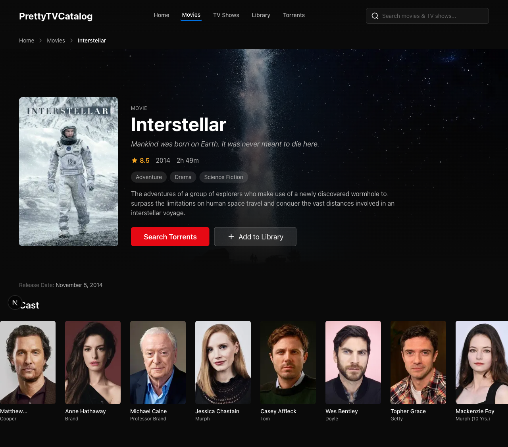
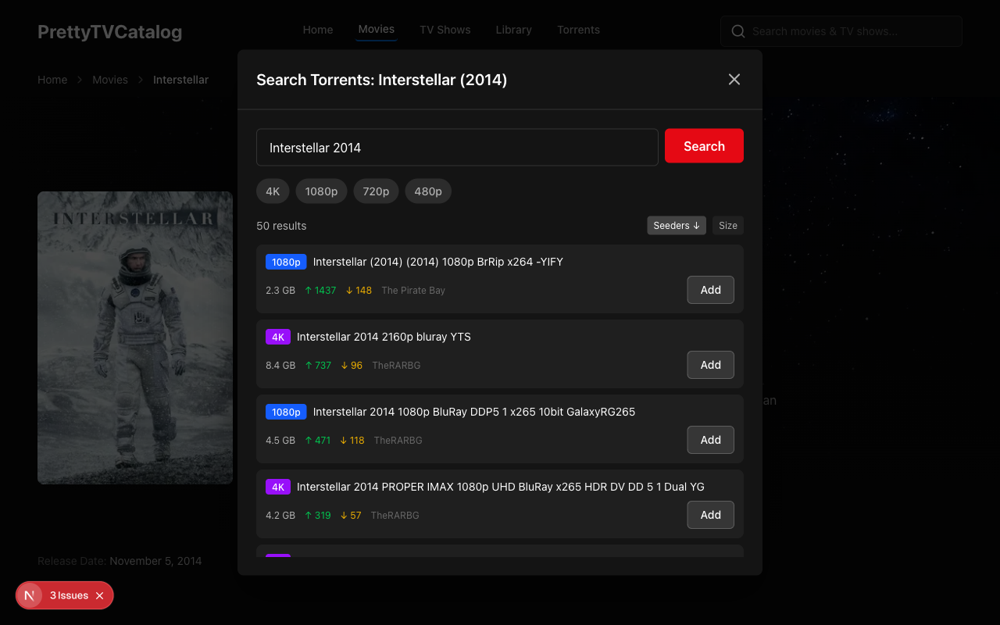
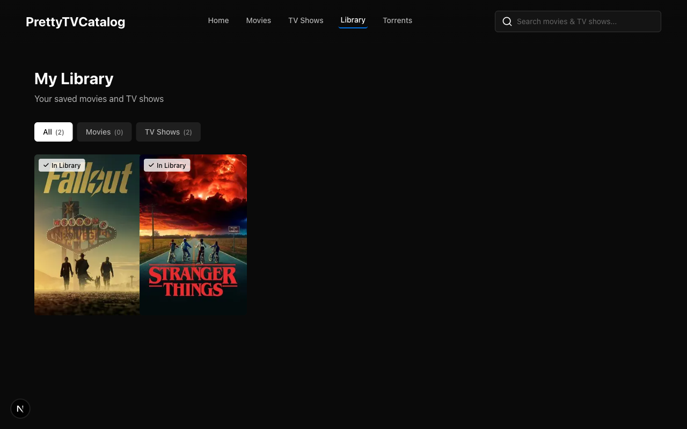

# Momoshtrem

A self-hosted torrent streaming server. Build your media library, search torrents, and stream instantly over WebDAV — no waiting for downloads.

<p align="center">
  
</p>

## Overview

A Docker-based media streaming stack with a Go backend, Next.js frontend, and Jackett for torrent indexing. Unlike the traditional *arr stack (Sonarr, Radarr, etc.) which downloads entire files before playback, this project streams torrents directly — similar to Stremio but fully self-hosted. Deploy it once on your server and connect from any device.

The web UI lets you browse TMDB, add movies and shows to your library, search for torrents across multiple indexers, and assign them with one click. Content is immediately available for streaming over WebDAV, so any compatible player — Infuse, VLC, nPlayer, or any WebDAV client — can play it on any device.

The backend uses a **library-first** virtual filesystem: the folder structure is driven by your library database, not by how torrents happen to name their files. You get clean `Movie Name (Year)/Movie Name (Year).mkv` paths and proper `Show/Season 01/S01E01.mkv` organization regardless of the torrent's internal structure.

## Features

**Library Management**
- Browse and search TMDB for movies and TV shows
- Add titles to your library with full metadata (posters, overviews, ratings)
- Per-episode tracking for TV shows with season/episode organization

**Torrent Streaming**
- Search torrents across all your Jackett indexers from the UI
- Quality and size filters to find the right release
- Instant streaming — piece prioritization ensures playback starts in seconds
- No waiting for full downloads

**Any Device via WebDAV**
- Clean virtual filesystem with proper naming
- HTTPS via Caddy reverse proxy
- Works with Infuse, VLC, nPlayer, or any WebDAV-compatible player
- One server, all your devices

**Subtitles**
- Search and download subtitles from OpenSubtitles
- Auto-placed alongside media files in the virtual filesystem

**Monitoring**
- Prometheus metrics endpoint
- Grafana dashboard included for streaming diagnostics

<p align="center">
  
  
  
</p>

## Architecture

```
                        ┌──────────────────────────────────┐
                        │   PrettyTVCatalog (:3000)        │
                        │   Browse, search, manage library  │
                        └───────────────┬──────────────────┘
                                        │
                ┌───────────────────────┼───────────────────────┐
                ▼                       ▼                       ▼
           TMDB API              Jackett (:9117)        momoshtrem (:4444)
                                                               │
                                                     ┌─────────┼─────────┐
                                                     ▼         ▼         ▼
                                                PostgreSQL  WebDAV    Prometheus
                                                 (:5432)   (:36911)   (:9090)
                                                               │
Player (Infuse/VLC/nPlayer) ──────► Caddy ─────────────────────┘
                                   (HTTPS + Basic Auth)
```

The frontend talks to TMDB for metadata, Jackett for torrent search, and momoshtrem for library management. momoshtrem stores the library in PostgreSQL and exposes a virtual filesystem over WebDAV. Caddy sits in front of WebDAV providing HTTPS and basic auth. Grafana (optional) connects to Prometheus metrics for streaming diagnostics.

## Quick Start

1. **Clone the repository**
   ```bash
   git clone https://github.com/AghaDostain/apple-tv-tor-stream.git
   cd apple-tv-tor-stream
   ```

2. **Configure environment variables**
   ```bash
   cp .env.example .env
   ```
   Fill in the required values:
   | Variable | Where to get it |
   |----------|----------------|
   | `APP_PASSWORD` | Choose a password for the web UI |
   | `TMDB_API_KEY` | [themoviedb.org/settings/api](https://www.themoviedb.org/settings/api) |
   | `SESSION_SECRET` | `openssl rand -base64 32` |
   | `POSTGRES_PASSWORD` | Choose a strong database password |

3. **Configure Caddy (reverse proxy)**
   ```bash
   cp Caddyfile.example Caddyfile
   ```
   Edit `Caddyfile` — set your domain/hostname and generate a password hash:
   ```bash
   docker run --rm caddy:2-alpine caddy hash-password --plaintext "YourPassword"
   ```

4. **Start all services**
   ```bash
   docker compose up -d
   ```

5. **Configure Jackett**
   - Open Jackett at `http://localhost:9117`
   - Add your preferred torrent indexers
   - Copy the API key from the top of the Jackett UI
   - Add it to `.env` as `JACKETT_API_KEY` and restart:
     ```bash
     docker compose up -d
     ```

6. **Open the web UI** at `http://localhost:3000`

7. **Connect your player** (Infuse, VLC, nPlayer, etc.) to WebDAV at `https://your-domain:36911` with the credentials from your Caddyfile.

## Configuration

### Environment Variables

See [`.env.example`](.env.example) for all available variables.

| Variable | Required | Description |
|----------|----------|-------------|
| `APP_PASSWORD` | Yes | Web UI authentication password |
| `TMDB_API_KEY` | Yes | TMDB API key for metadata |
| `SESSION_SECRET` | Yes | JWT signing secret |
| `POSTGRES_PASSWORD` | Yes | PostgreSQL database password |
| `JACKETT_API_KEY` | No | Jackett API key (configure after first run) |
| `OPENSUBTITLES_API_KEY` | No | OpenSubtitles API key for subtitle search |
| `OPENSUBTITLES_USERNAME` | No | OpenSubtitles account username |
| `OPENSUBTITLES_PASSWORD` | No | OpenSubtitles account password |

### Streaming Tuning

See [`momoshtrem/config.yaml.example`](momoshtrem/config.yaml.example) for torrent client and streaming buffer configuration (cache size, readahead, timeouts).

### Reverse Proxy

See [`Caddyfile.example`](Caddyfile.example) for the Caddy reverse proxy setup including HTTPS, basic auth, and LAN-only access for metrics/pgAdmin.

## Project Structure

```
apple-tv-tor-stream/
├── momoshtrem/              # Go backend — torrent streaming, WebDAV, library API
│   ├── cmd/momoshtrem/      # Entry point
│   ├── internal/
│   │   ├── api/             # REST API handlers
│   │   ├── vfs/             # Virtual filesystem (library-driven)
│   │   ├── torrent/         # Torrent client wrapper
│   │   └── streaming/       # Piece prioritization
│   └── config.yaml.example
├── PrettyTVCatalog/         # Next.js frontend — browse, search, manage
│   ├── src/app/             # Pages and API routes
│   ├── src/lib/api/         # API clients (momoshtrem, jackett, tmdb)
│   └── src/types/           # TypeScript interfaces
├── grafana/                 # Grafana dashboard provisioning
├── docs/                    # Documentation and code quality guides
├── compose.yml              # Docker Compose stack
├── Caddyfile.example        # Reverse proxy configuration
└── .env.example             # Environment variable template
```

## How It Works

Traditional torrent-based media setups download files to disk first, then serve them:

```
Traditional:  torrent files  →  download to disk  →  filesystem  →  player
This project: library (DB)   →  virtual filesystem  →  torrent pieces streamed on demand  →  player
```

The virtual filesystem is built from your library database. When you add a movie or show, momoshtrem creates the folder structure immediately. When you assign a torrent, the files are mapped into that structure. When a player reads a file, only the needed pieces are fetched from the swarm — starting from the playback position with intelligent readahead buffering.

## Services

| Service | Port | Description |
|---------|------|-------------|
| **PrettyTVCatalog** | 3000 | Next.js web UI for browsing, searching, and managing your library |
| **momoshtrem** | 4444 (internal) | Go backend — REST API, torrent client, library management |
| **momoshtrem WebDAV** | 36911 | Virtual filesystem endpoint for media players |
| **Jackett** | 9117 | Torrent indexer aggregator — search across multiple trackers |
| **PostgreSQL** | 5432 (internal) | Library and metadata storage |
| **Caddy** | 36911, 9090, 5050 | Reverse proxy — HTTPS, basic auth, LAN-only routes |

## Contributing

Contributions are welcome! See [CONTRIBUTING.md](CONTRIBUTING.md) for development setup, code quality standards, and the pull request process.

## Acknowledgments

- [anacrolix/torrent](https://github.com/anacrolix/torrent) — Go torrent library powering the streaming engine
- [Jackett](https://github.com/Jackett/Jackett) — Torrent indexer proxy
- [TMDB](https://www.themoviedb.org/) — Movie and TV metadata
- [Infuse](https://firecore.com/infuse) — WebDAV-compatible media player
- [distribyted](https://github.com/distribyted/distribyted) — Inspiration for torrent-based virtual filesystems

## License

This project is licensed under the [GNU General Public License v3.0](LICENSE).
